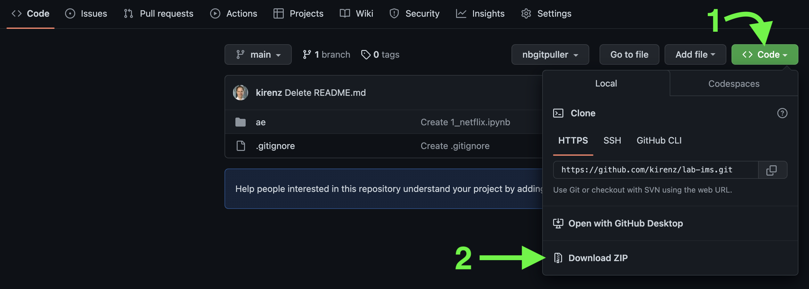

# Application exercises
 
Welcome :wave: 
 
This repo contains application exercises.

## Create working environment

Create the conda environment `nlu` (natural language understanding):

```bash
conda create --name nlu python=3.11 pip
```

Activate the environment:

```bash
conda activate nlu
```

Now install some packages:

```bash
pip install jupyter ipykernel nltk wordcloud pandas altair
```

---

Download this repository as zip-file (click on the green `<> Code`button at the top of this page and choose `Download ZIP`) button:




